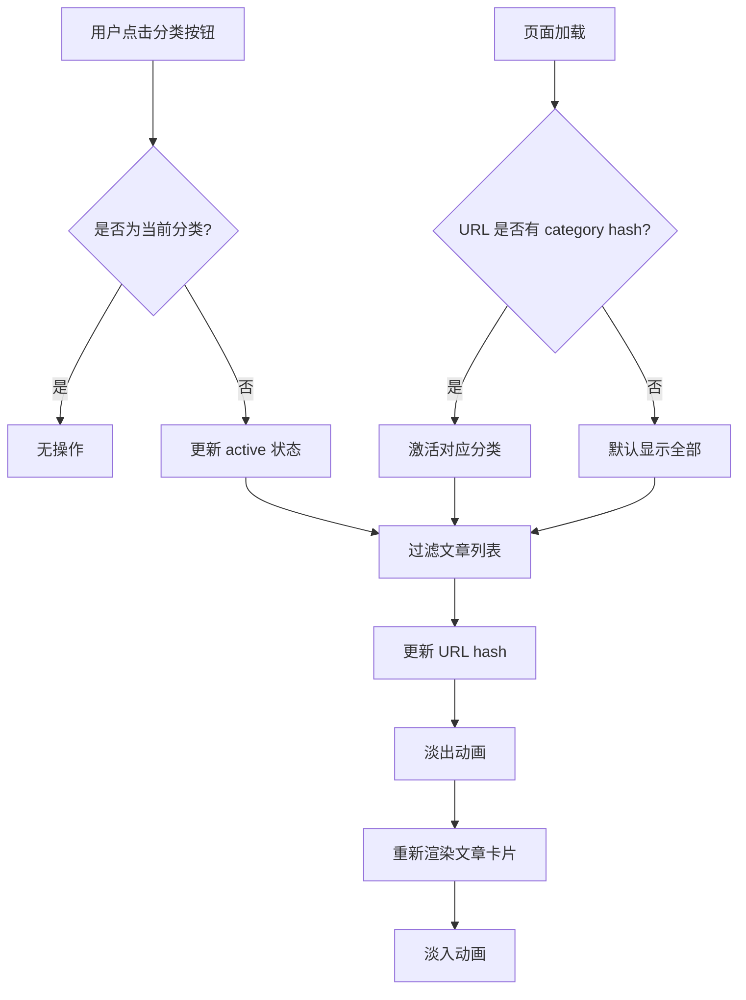
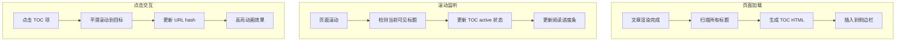
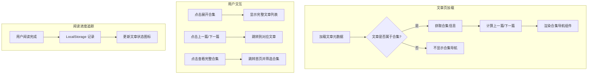
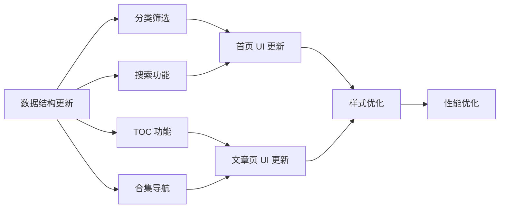

# 文章管理系统增强方案设计文档

> **项目**: TYPERBODY 超频空间博客  
> **版本**: v1.0  
> **日期**: 2026-03-12  

---

## 一、现有架构分析

### 1.1 当前数据结构

```json
{
    "id": "welcome-to-hypertrance",
    "title": "欢迎来到超频空间",
    "date": "2024-01-15",
    "excerpt": "文章摘要...",
    "tags": ["博客", "Y2K", "Hypertrance"],
    "category": "博客"
}
```

**现有字段**：
- `id` - 文章唯一标识，与 Markdown 文件名一致
- `title` - 文章标题
- `date` - 发布日期
- `excerpt` - 文章摘要
- `tags` - 标签数组
- `category` - 分类（已存在但未被 UI 使用）

### 1.2 现有功能

| 功能 | 状态 | 说明 |
|------|------|------|
| 文章列表展示 | ✅ 已实现 | 按日期倒序显示 |
| 文章详情页 | ✅ 已实现 | Markdown 渲染 |
| 标签显示 | ✅ 已实现 | 仅显示，无筛选功能 |
| 分类筛选 | ❌ 未实现 | category 字段未使用 |
| 文章目录 | ❌ 未实现 | 无 TOC 功能 |
| 合集导航 | ❌ 未实现 | 无合集概念 |
| 搜索功能 | ❌ 未实现 | 无搜索功能 |

### 1.3 技术栈

- 纯静态网站（HTML/CSS/JS）
- marked.js 用于 Markdown 解析
- GitHub Pages 托管
- 无后端服务

---

## 二、增强型数据结构设计

### 2.1 新版 index.json 结构

```json
{
    "meta": {
        "version": "2.0",
        "lastUpdated": "2026-03-12",
        "totalArticles": 5
    },
    "categories": [
        {
            "id": "blog",
            "name": "博客",
            "icon": "◈",
            "description": "个人随笔与博客动态",
            "color": "#00d4ff"
        },
        {
            "id": "design",
            "name": "设计",
            "icon": "✦",
            "description": "设计理念与美学探索",
            "color": "#ff00ff"
        },
        {
            "id": "tutorial",
            "name": "教程",
            "icon": "⟐",
            "description": "技术教程与学习指南",
            "color": "#00ff80"
        },
        {
            "id": "dev",
            "name": "开发",
            "icon": "⬡",
            "description": "编程与开发相关",
            "color": "#ffaa00"
        }
    ],
    "collections": [
        {
            "id": "y2k-series",
            "name": "Y2K 美学系列",
            "description": "探索 Y2K 设计美学的系列文章",
            "cover": "◇",
            "articles": ["welcome-to-hypertrance", "y2k-design-aesthetics"]
        },
        {
            "id": "markdown-guide",
            "name": "Markdown 完全指南",
            "description": "从入门到精通的 Markdown 教程",
            "cover": "⏣",
            "articles": ["markdown-tutorial"]
        }
    ],
    "articles": [
        {
            "id": "welcome-to-hypertrance",
            "title": "欢迎来到超频空间",
            "date": "2024-01-15",
            "updated": "2024-01-20",
            "excerpt": "这是我的第一篇博客文章...",
            "tags": ["博客", "Y2K", "Hypertrance"],
            "category": "blog",
            "collection": "y2k-series",
            "collectionOrder": 1,
            "featured": true,
            "readingTime": 3,
            "headings": [
                { "level": 2, "text": "关于这个博客", "anchor": "about-blog" },
                { "level": 2, "text": "技术栈", "anchor": "tech-stack" },
                { "level": 2, "text": "如何添加文章", "anchor": "how-to-add" },
                { "level": 2, "text": "未来计划", "anchor": "future-plans" }
            ]
        },
        {
            "id": "y2k-design-aesthetics",
            "title": "Y2K 设计美学：未来已来",
            "date": "2024-01-20",
            "excerpt": "探索 Y2K 设计美学的核心元素...",
            "tags": ["设计", "Y2K", "美学"],
            "category": "design",
            "collection": "y2k-series",
            "collectionOrder": 2,
            "featured": false,
            "readingTime": 5,
            "headings": [
                { "level": 2, "text": "什么是 Y2K 美学？", "anchor": "what-is-y2k" },
                { "level": 3, "text": "1. 霓虹色彩", "anchor": "neon-colors" },
                { "level": 3, "text": "2. 几何形状", "anchor": "geometric-shapes" },
                { "level": 3, "text": "3. 故障艺术", "anchor": "glitch-art" },
                { "level": 2, "text": "Hypertrance 与视觉", "anchor": "hypertrance-visual" },
                { "level": 2, "text": "在现代设计中的应用", "anchor": "modern-application" },
                { "level": 2, "text": "设计建议", "anchor": "design-tips" }
            ]
        },
        {
            "id": "markdown-tutorial",
            "title": "Markdown 写作指南",
            "date": "2024-01-25",
            "excerpt": "学习如何使用 Markdown 语法...",
            "tags": ["教程", "Markdown", "写作"],
            "category": "tutorial",
            "collection": "markdown-guide",
            "collectionOrder": 1,
            "featured": false,
            "readingTime": 8,
            "headings": [
                { "level": 2, "text": "标题", "anchor": "headings" },
                { "level": 2, "text": "文本格式", "anchor": "text-format" },
                { "level": 3, "text": "粗体和斜体", "anchor": "bold-italic" },
                { "level": 2, "text": "列表", "anchor": "lists" },
                { "level": 2, "text": "链接和图片", "anchor": "links-images" },
                { "level": 2, "text": "代码", "anchor": "code" },
                { "level": 2, "text": "引用", "anchor": "quotes" },
                { "level": 2, "text": "表格", "anchor": "tables" },
                { "level": 2, "text": "写作建议", "anchor": "writing-tips" }
            ]
        }
    ]
}
```

### 2.2 字段说明

#### 新增元数据字段

| 字段 | 类型 | 说明 |
|------|------|------|
| `meta` | Object | 索引文件元信息 |
| `meta.version` | String | 数据结构版本号 |
| `meta.lastUpdated` | String | 最后更新日期 |
| `meta.totalArticles` | Number | 文章总数 |

#### 分类定义字段

| 字段 | 类型 | 说明 |
|------|------|------|
| `categories` | Array | 分类定义列表 |
| `categories[].id` | String | 分类唯一标识 |
| `categories[].name` | String | 分类显示名称 |
| `categories[].icon` | String | 分类图标（Unicode符号） |
| `categories[].description` | String | 分类描述 |
| `categories[].color` | String | 分类主题色 |

#### 合集定义字段

| 字段 | 类型 | 说明 |
|------|------|------|
| `collections` | Array | 合集定义列表 |
| `collections[].id` | String | 合集唯一标识 |
| `collections[].name` | String | 合集显示名称 |
| `collections[].description` | String | 合集描述 |
| `collections[].cover` | String | 合集封面图标 |
| `collections[].articles` | Array | 合集内文章ID列表（有序） |

#### 文章新增字段

| 字段 | 类型 | 说明 |
|------|------|------|
| `updated` | String | 最后更新日期（可选） |
| `collection` | String | 所属合集ID（可选） |
| `collectionOrder` | Number | 在合集中的顺序 |
| `featured` | Boolean | 是否为精选文章 |
| `readingTime` | Number | 预估阅读时间（分钟） |
| `headings` | Array | 文章标题结构（用于TOC） |
| `headings[].level` | Number | 标题级别（2-6） |
| `headings[].text` | String | 标题文本 |
| `headings[].anchor` | String | 锚点ID |

---

## 三、分类筛选系统设计

### 3.1 UI 设计

#### 首页分类导航栏

```
┌─────────────────────────────────────────────────────────────────┐
│  [LATEST_POSTS]                                                 │
├─────────────────────────────────────────────────────────────────┤
│                                                                 │
│  ◈ 全部    ◈ 博客    ✦ 设计    ⟐ 教程    ⬡ 开发               │
│  ━━━━━━━   ─────     ─────     ─────     ─────                  │
│  (active)                                                       │
│                                                                 │
└─────────────────────────────────────────────────────────────────┘
```

#### 分类筛选组件 HTML 结构

```html
<div class="category-filter">
    <button class="filter-btn active" data-category="all">
        <span class="filter-icon">◈</span>
        <span class="filter-text">全部</span>
        <span class="filter-count">5</span>
    </button>
    <button class="filter-btn" data-category="blog">
        <span class="filter-icon">◈</span>
        <span class="filter-text">博客</span>
        <span class="filter-count">2</span>
    </button>
    <button class="filter-btn" data-category="design">
        <span class="filter-icon">✦</span>
        <span class="filter-text">设计</span>
        <span class="filter-count">1</span>
    </button>
    <!-- 更多分类... -->
</div>
```

### 3.2 交互设计



### 3.3 URL 设计

- 全部文章：`index.html` 或 `index.html#all`
- 分类筛选：`index.html#category=design`
- 标签筛选：`index.html#tag=Y2K`

### 3.4 CSS 样式要点

```css
/* 分类筛选按钮样式 */
.category-filter {
    display: flex;
    gap: 20px;
    padding: 20px 40px;
    overflow-x: auto;
    scrollbar-width: none;
}

.filter-btn {
    display: flex;
    align-items: center;
    gap: 8px;
    padding: 10px 20px;
    background: rgba(0, 212, 255, 0.05);
    border: 1px solid rgba(192, 199, 214, 0.2);
    border-radius: 25px;
    color: var(--text-secondary);
    cursor: pointer;
    transition: all 0.3s ease;
    white-space: nowrap;
}

.filter-btn:hover {
    background: rgba(0, 212, 255, 0.1);
    border-color: var(--neon-accent);
    transform: translateY(-2px);
}

.filter-btn.active {
    background: rgba(0, 212, 255, 0.15);
    border-color: var(--neon-accent);
    color: var(--neon-accent);
    box-shadow: 0 0 20px rgba(0, 212, 255, 0.2);
}

.filter-count {
    font-size: 0.75rem;
    padding: 2px 6px;
    background: rgba(0, 212, 255, 0.2);
    border-radius: 10px;
}
```

---

## 四、文章目录（TOC）设计

### 4.1 TOC 生成方案

#### 方案选择

| 方案 | 优点 | 缺点 | 推荐度 |
|------|------|------|--------|
| **A. 预生成存储在 index.json** | 加载快，无需解析 | 需要手动维护或构建工具 | ⭐⭐⭐⭐ |
| **B. 实时解析 Markdown** | 自动化，无需维护 | 需要两次获取文章内容 | ⭐⭐⭐ |
| **C. 从渲染后的 HTML 提取** | 简单直接 | 需要等待渲染完成 | ⭐⭐⭐⭐⭐ |

**推荐方案**：采用方案 C（从渲染后 HTML 提取），并将结果缓存到 index.json 作为备用。

#### 实时 TOC 生成算法

```javascript
function generateTOC(articleBody) {
    const headings = articleBody.querySelectorAll('h2, h3, h4, h5, h6');
    const toc = [];
    
    headings.forEach((heading, index) => {
        // 生成唯一锚点ID
        const anchor = heading.id || generateAnchorId(heading.textContent, index);
        heading.id = anchor;
        
        toc.push({
            level: parseInt(heading.tagName.charAt(1)),
            text: heading.textContent,
            anchor: anchor
        });
    });
    
    return toc;
}

function generateAnchorId(text, index) {
    // 将中文转换为拼音或使用 index
    const sanitized = text
        .toLowerCase()
        .replace(/[^\w\u4e00-\u9fa5]+/g, '-')
        .replace(/^-+|-+$/g, '');
    return sanitized || `heading-${index}`;
}
```

### 4.2 TOC UI 设计

#### 桌面端 - 侧边栏固定

```
┌────────────────────────────────────────────────────────────────────────┐
│                                                                        │
│  ┌─────────────────────────────────────────┐  ┌────────────────────┐  │
│  │                                         │  │ [目录]             │  │
│  │  # 文章标题                             │  │                    │  │
│  │                                         │  │ ├─ 一级标题        │  │
│  │  文章内容...                            │  │ │  ├─ 二级标题     │  │
│  │                                         │  │ │  └─ 二级标题     │  │
│  │  ## 一级标题                            │  │ ├─ 一级标题        │  │
│  │                                         │  │ └─ 一级标题        │  │
│  │  内容...                                │  │                    │  │
│  │                                         │  │                    │  │
│  │  ### 二级标题                           │  │                    │  │
│  │                                         │  │                    │  │
│  │  内容...                                │  │                    │  │
│  │                                         │  │                    │  │
│  └─────────────────────────────────────────┘  └────────────────────┘  │
│                                                                        │
└────────────────────────────────────────────────────────────────────────┘
```

#### 移动端 - 悬浮按钮 + 弹出面板

```
┌──────────────────────────┐
│  # 文章标题              │
│                          │
│  文章内容...             │
│                          │
│  ## 一级标题             │
│                          │    ┌────────────────────┐
│  内容...             [目] │ => │ [目录]             │
│                          │    │                    │
│  ### 二级标题            │    │ ├─ 一级标题        │
│                          │    │ │  ├─ 二级标题     │
│  内容...                 │    │ │  └─ 二级标题     │
│                          │    │ └─ 一级标题        │
└──────────────────────────┘    └────────────────────┘
```

### 4.3 TOC HTML 结构

```html
<!-- 桌面端侧边栏 -->
<aside class="toc-sidebar" id="toc-sidebar">
    <div class="toc-header">
        <span class="toc-icon">⟐</span>
        <span class="toc-title">目录 // TOC</span>
    </div>
    <nav class="toc-nav" id="toc-nav">
        <ul class="toc-list">
            <li class="toc-item level-2 active">
                <a href="#about-blog" class="toc-link">关于这个博客</a>
            </li>
            <li class="toc-item level-2">
                <a href="#tech-stack" class="toc-link">技术栈</a>
            </li>
            <li class="toc-item level-3">
                <a href="#frontend" class="toc-link">前端技术</a>
            </li>
            <!-- 更多项... -->
        </ul>
    </nav>
    <div class="toc-progress">
        <div class="toc-progress-bar" id="toc-progress"></div>
    </div>
</aside>

<!-- 移动端悬浮按钮 -->
<button class="toc-fab" id="toc-fab" aria-label="打开目录">
    <span class="fab-icon">≡</span>
</button>

<!-- 移动端目录面板 -->
<div class="toc-panel" id="toc-panel">
    <div class="toc-panel-header">
        <span>目录 // TOC</span>
        <button class="toc-close" id="toc-close">×</button>
    </div>
    <nav class="toc-panel-nav">
        <!-- TOC 内容复制 -->
    </nav>
</div>
```

### 4.4 TOC 交互功能



### 4.5 TOC CSS 样式

```css
/* 目录侧边栏 */
.toc-sidebar {
    position: fixed;
    right: 40px;
    top: 150px;
    width: 250px;
    max-height: calc(100vh - 200px);
    background: rgba(2, 3, 6, 0.9);
    border: 1px solid rgba(192, 199, 214, 0.15);
    border-radius: 12px;
    padding: 20px;
    backdrop-filter: blur(10px);
    overflow-y: auto;
    z-index: 100;
}

.toc-header {
    display: flex;
    align-items: center;
    gap: 10px;
    margin-bottom: 15px;
    padding-bottom: 15px;
    border-bottom: 1px solid rgba(192, 199, 214, 0.1);
}

.toc-icon {
    color: var(--neon-accent);
}

.toc-title {
    font-family: var(--font-display);
    font-size: 0.85rem;
    color: var(--text-secondary);
    letter-spacing: 2px;
}

.toc-list {
    list-style: none;
    padding: 0;
    margin: 0;
}

.toc-item {
    margin-bottom: 8px;
}

.toc-item.level-2 { padding-left: 0; }
.toc-item.level-3 { padding-left: 15px; }
.toc-item.level-4 { padding-left: 30px; }

.toc-link {
    display: block;
    color: var(--text-muted);
    text-decoration: none;
    font-size: 0.85rem;
    padding: 5px 10px;
    border-left: 2px solid transparent;
    transition: all 0.2s ease;
}

.toc-link:hover {
    color: var(--text-primary);
    border-left-color: rgba(0, 212, 255, 0.3);
}

.toc-item.active .toc-link {
    color: var(--neon-accent);
    border-left-color: var(--neon-accent);
    background: rgba(0, 212, 255, 0.05);
}

/* 阅读进度条 */
.toc-progress {
    position: absolute;
    bottom: 0;
    left: 0;
    right: 0;
    height: 3px;
    background: rgba(192, 199, 214, 0.1);
    border-radius: 0 0 12px 12px;
    overflow: hidden;
}

.toc-progress-bar {
    height: 100%;
    width: 0%;
    background: linear-gradient(90deg, var(--neon-accent), #ff00ff);
    transition: width 0.1s ease;
}

/* 移动端悬浮按钮 */
.toc-fab {
    display: none;
    position: fixed;
    right: 20px;
    bottom: 80px;
    width: 50px;
    height: 50px;
    border-radius: 50%;
    background: rgba(0, 212, 255, 0.2);
    border: 1px solid var(--neon-accent);
    color: var(--neon-accent);
    font-size: 1.5rem;
    cursor: pointer;
    z-index: 1000;
    backdrop-filter: blur(10px);
    box-shadow: 0 0 20px rgba(0, 212, 255, 0.3);
}

@media (max-width: 1200px) {
    .toc-sidebar {
        display: none;
    }
    
    .toc-fab {
        display: flex;
        align-items: center;
        justify-content: center;
    }
}
```

---

## 五、合集导航设计

### 5.1 合集概念

合集（Collection）是一组相关文章的有序集合，用于：
- 系列教程的连续阅读
- 主题文章的归类
- 提供上下文导航

### 5.2 合集导航 UI

#### 文章详情页 - 合集导航条

```
┌─────────────────────────────────────────────────────────────────┐
│                                                                 │
│  ┌───────────────────────────────────────────────────────────┐  │
│  │ ◇ Y2K 美学系列                                    [2/3] │  │
│  │ ───────────────────────────────────────────────────────── │  │
│  │ ← 上一篇：欢迎来到超频空间                               │  │
│  │ → 下一篇：Y2K 色彩搭配指南                               │  │
│  │                                                           │  │
│  │ [查看完整合集 ↗]                                         │  │
│  └───────────────────────────────────────────────────────────┘  │
│                                                                 │
│  # 当前文章标题                                                 │
│                                                                 │
│  文章内容...                                                   │
│                                                                 │
└─────────────────────────────────────────────────────────────────┘
```

#### 合集展开面板

```
┌───────────────────────────────────────────────────────────────┐
│ ◇ Y2K 美学系列                                                │
│ 探索 Y2K 设计美学的系列文章                                    │
├───────────────────────────────────────────────────────────────┤
│                                                               │
│  1. ○ 欢迎来到超频空间              2024.01.15  [3分钟]      │
│                                                               │
│  2. ● Y2K 设计美学：未来已来        2024.01.20  [5分钟]      │
│     └── 当前阅读                                              │
│                                                               │
│  3. ○ Y2K 色彩搭配指南              2024.01.25  [4分钟]      │
│                                                               │
└───────────────────────────────────────────────────────────────┘
```

### 5.3 合集导航 HTML 结构

```html
<!-- 合集导航组件 -->
<div class="collection-nav" id="collection-nav">
    <div class="collection-header">
        <span class="collection-icon">◇</span>
        <div class="collection-info">
            <h4 class="collection-name">Y2K 美学系列</h4>
            <span class="collection-progress">2 / 3</span>
        </div>
        <button class="collection-toggle" id="collection-toggle" aria-expanded="false">
            <span class="toggle-icon">▼</span>
        </button>
    </div>
    
    <!-- 快速导航 -->
    <div class="collection-quick-nav">
        <a href="post.html?id=welcome-to-hypertrance" class="quick-nav-btn prev">
            <span class="nav-direction">← 上一篇</span>
            <span class="nav-title">欢迎来到超频空间</span>
        </a>
        <a href="post.html?id=y2k-colors" class="quick-nav-btn next">
            <span class="nav-direction">下一篇 →</span>
            <span class="nav-title">Y2K 色彩搭配指南</span>
        </a>
    </div>
    
    <!-- 完整文章列表（可折叠） -->
    <div class="collection-list" id="collection-list" hidden>
        <div class="collection-description">
            探索 Y2K 设计美学的系列文章
        </div>
        <ol class="collection-articles">
            <li class="collection-article">
                <a href="post.html?id=welcome-to-hypertrance">
                    <span class="article-status">○</span>
                    <span class="article-title">欢迎来到超频空间</span>
                    <span class="article-meta">2024.01.15 · 3分钟</span>
                </a>
            </li>
            <li class="collection-article current">
                <a href="#">
                    <span class="article-status">●</span>
                    <span class="article-title">Y2K 设计美学：未来已来</span>
                    <span class="article-meta">当前阅读</span>
                </a>
            </li>
            <li class="collection-article">
                <a href="post.html?id=y2k-colors">
                    <span class="article-status">○</span>
                    <span class="article-title">Y2K 色彩搭配指南</span>
                    <span class="article-meta">2024.01.25 · 4分钟</span>
                </a>
            </li>
        </ol>
        <a href="index.html#collection=y2k-series" class="view-all-link">
            查看完整合集 ↗
        </a>
    </div>
</div>
```

### 5.4 首页合集展示区

```html
<!-- 首页合集展示 -->
<section class="collections-section" id="collections">
    <div class="section-header">
        <h2 class="section-title">
            <span class="title-bracket">[</span>
            COLLECTIONS
            <span class="title-bracket">]</span>
        </h2>
    </div>
    <div class="collections-grid">
        <a href="index.html#collection=y2k-series" class="collection-card">
            <div class="collection-cover">◇</div>
            <div class="collection-content">
                <h3 class="collection-card-title">Y2K 美学系列</h3>
                <p class="collection-card-desc">探索 Y2K 设计美学的系列文章</p>
                <div class="collection-card-meta">
                    <span>3 篇文章</span>
                    <span>·</span>
                    <span>12 分钟阅读</span>
                </div>
            </div>
        </a>
        <!-- 更多合集卡片... -->
    </div>
</section>
```

### 5.5 合集导航交互流程



---

## 六、搜索功能设计

### 6.1 搜索方案

由于是静态网站，采用**前端全文搜索**方案：

| 方案 | 实现方式 | 优点 | 缺点 |
|------|---------|------|------|
| **简单搜索** | 遍历 index.json | 实现简单 | 只能搜索标题和摘要 |
| **全文搜索** | 预加载所有文章 | 可搜索全部内容 | 首次加载较慢 |
| **Fuse.js** | 模糊搜索库 | 支持模糊匹配、权重 | 需要引入库 |
| **MiniSearch** | 轻量搜索库 | 全文索引、高性能 | 需要引入库 |

**推荐方案**：使用 **Fuse.js** 实现模糊搜索，支持：
- 标题搜索（高权重）
- 摘要搜索（中权重）
- 标签搜索（中权重）
- 全文搜索（低权重，可选）

### 6.2 搜索 UI 设计

#### 搜索入口

```
┌─────────────────────────────────────────────────────────────────┐
│  TYPERBODY                                POSTS  ABOUT  [🔍]    │
└─────────────────────────────────────────────────────────────────┘
                                                        ↓ 点击
┌─────────────────────────────────────────────────────────────────┐
│                                                                 │
│     ┌───────────────────────────────────────────────────┐      │
│     │ 🔍  搜索文章...                              [ESC] │      │
│     └───────────────────────────────────────────────────┘      │
│                                                                 │
│     最近搜索：Y2K  Markdown  设计                               │
│                                                                 │
│     热门标签：#博客  #Y2K  #教程  #设计                          │
│                                                                 │
└─────────────────────────────────────────────────────────────────┘
```

#### 搜索结果

```
┌─────────────────────────────────────────────────────────────────┐
│                                                                 │
│     ┌───────────────────────────────────────────────────┐      │
│     │ 🔍  Y2K                                      [×]   │      │
│     └───────────────────────────────────────────────────┘      │
│                                                                 │
│     找到 2 个结果                                                │
│                                                                 │
│     ┌─────────────────────────────────────────────────┐        │
│     │ ✦ Y2K 设计美学：未来已来                        │        │
│     │   探索 Y2K 设计美学的核心元素...                │        │
│     │   设计 · 2024.01.20                            │        │
│     └─────────────────────────────────────────────────┘        │
│                                                                 │
│     ┌─────────────────────────────────────────────────┐        │
│     │ ◈ 欢迎来到超频空间                              │        │
│     │   这是一个采用 Y2K Hypertrance 风格设计的...    │        │
│     │   博客 · 2024.01.15                            │        │
│     └─────────────────────────────────────────────────┘        │
│                                                                 │
└─────────────────────────────────────────────────────────────────┘
```

### 6.3 搜索组件 HTML

```html
<!-- 搜索按钮 -->
<button class="search-trigger" id="search-trigger" aria-label="打开搜索">
    <span class="search-icon">🔍</span>
    <span class="search-shortcut">Ctrl+K</span>
</button>

<!-- 搜索模态框 -->
<div class="search-modal" id="search-modal" hidden>
    <div class="search-backdrop" id="search-backdrop"></div>
    <div class="search-container">
        <div class="search-header">
            <span class="search-icon">🔍</span>
            <input 
                type="text" 
                class="search-input" 
                id="search-input"
                placeholder="搜索文章..."
                autocomplete="off"
            >
            <kbd class="search-esc">ESC</kbd>
        </div>
        
        <div class="search-body" id="search-body">
            <!-- 默认状态：显示最近搜索和热门标签 -->
            <div class="search-default" id="search-default">
                <div class="search-section">
                    <h4 class="search-section-title">最近搜索</h4>
                    <div class="recent-searches" id="recent-searches">
                        <button class="recent-item">Y2K</button>
                        <button class="recent-item">Markdown</button>
                    </div>
                </div>
                <div class="search-section">
                    <h4 class="search-section-title">热门标签</h4>
                    <div class="popular-tags" id="popular-tags">
                        <button class="tag-item">#博客</button>
                        <button class="tag-item">#Y2K</button>
                        <button class="tag-item">#教程</button>
                    </div>
                </div>
            </div>
            
            <!-- 搜索结果 -->
            <div class="search-results" id="search-results" hidden>
                <div class="results-count" id="results-count">找到 0 个结果</div>
                <div class="results-list" id="results-list">
                    <!-- 动态插入搜索结果 -->
                </div>
            </div>
            
            <!-- 无结果状态 -->
            <div class="search-empty" id="search-empty" hidden>
                <span class="empty-icon">◇</span>
                <p class="empty-text">未找到相关文章</p>
                <p class="empty-tip">尝试使用其他关键词</p>
            </div>
        </div>
        
        <div class="search-footer">
            <div class="search-tips">
                <kbd>↑↓</kbd> 导航
                <kbd>Enter</kbd> 打开
                <kbd>ESC</kbd> 关闭
            </div>
        </div>
    </div>
</div>
```

### 6.4 搜索功能实现

```javascript
// 搜索配置
const searchConfig = {
    keys: [
        { name: 'title', weight: 0.4 },
        { name: 'excerpt', weight: 0.3 },
        { name: 'tags', weight: 0.2 },
        { name: 'category', weight: 0.1 }
    ],
    threshold: 0.3,
    ignoreLocation: true,
    includeScore: true,
    includeMatches: true
};

// 初始化搜索
async function initSearch() {
    const response = await fetch(CONFIG.articlesIndex);
    const data = await response.json();
    const articles = data.articles;
    
    // 初始化 Fuse.js
    const fuse = new Fuse(articles, searchConfig);
    
    // 绑定搜索事件
    const searchInput = document.getElementById('search-input');
    searchInput.addEventListener('input', debounce((e) => {
        performSearch(fuse, e.target.value);
    }, 200));
}

// 执行搜索
function performSearch(fuse, query) {
    if (!query.trim()) {
        showDefaultState();
        return;
    }
    
    const results = fuse.search(query);
    displayResults(results);
    saveRecentSearch(query);
}

// 显示搜索结果
function displayResults(results) {
    const resultsList = document.getElementById('results-list');
    const resultsCount = document.getElementById('results-count');
    
    if (results.length === 0) {
        showEmptyState();
        return;
    }
    
    resultsCount.textContent = `找到 ${results.length} 个结果`;
    
    resultsList.innerHTML = results.map(({ item, matches }) => `
        <a href="post.html?id=${item.id}" class="result-item">
            <span class="result-icon">${getCategoryIcon(item.category)}</span>
            <div class="result-content">
                <h4 class="result-title">${highlightMatches(item.title, matches)}</h4>
                <p class="result-excerpt">${item.excerpt}</p>
                <div class="result-meta">
                    <span>${item.category}</span>
                    <span>·</span>
                    <span>${formatDate(item.date)}</span>
                </div>
            </div>
        </a>
    `).join('');
    
    showResultsState();
}
```

### 6.5 键盘快捷键

| 快捷键 | 功能 |
|--------|------|
| `Ctrl+K` / `Cmd+K` | 打开搜索 |
| `ESC` | 关闭搜索 |
| `↑` / `↓` | 导航结果 |
| `Enter` | 打开选中文章 |

---

## 七、实现优先级与依赖关系

### 7.1 实现顺序

```mermaid
gantt
    title 功能实现顺序
    dateFormat X
    axisFormat %s
    
    section 基础设施
    更新 index.json 数据结构    :a1, 0, 1
    
    section 核心功能
    分类筛选功能                :a2, after a1, 2
    文章目录 TOC               :a3, after a1, 2
    
    section 增强功能
    合集导航功能                :a4, after a2, 2
    搜索功能                    :a5, after a2, 3
    
    section 优化
    样式优化与响应式            :a6, after a5, 1
    性能优化                    :a7, after a6, 1
```



### 7.2 依赖关系



### 7.3 实现任务清单

#### 阶段一：数据结构
- [ ] 设计新版 index.json 结构
- [ ] 迁移现有文章数据
- [ ] 添加 headings 字段（TOC 预生成）
- [ ] 创建构建脚本（可选，用于自动生成 headings）

#### 阶段二：分类筛选
- [ ] 创建分类筛选组件 HTML
- [ ] 实现分类筛选 CSS 样式
- [ ] 实现筛选 JavaScript 逻辑
- [ ] 添加 URL hash 支持
- [ ] 添加筛选动画效果

#### 阶段三：文章目录
- [ ] 创建 TOC 侧边栏组件
- [ ] 实现 TOC 自动生成
- [ ] 添加滚动监听高亮
- [ ] 添加阅读进度条
- [ ] 实现移动端 TOC 面板

#### 阶段四：合集导航
- [ ] 创建合集导航组件
- [ ] 实现上下篇导航
- [ ] 添加合集文章列表
- [ ] 首页合集展示区
- [ ] 阅读进度 LocalStorage

#### 阶段五：搜索功能
- [ ] 集成 Fuse.js
- [ ] 创建搜索模态框
- [ ] 实现搜索逻辑
- [ ] 添加最近搜索功能
- [ ] 添加键盘快捷键

---

## 八、文件修改清单

| 文件 | 修改类型 | 说明 |
|------|---------|------|
| `posts/index.json` | 重构 | 升级为新数据结构 |
| `index.html` | 修改 | 添加分类筛选、搜索入口、合集展示 |
| `post.html` | 修改 | 添加 TOC 侧边栏、合集导航 |
| `js/main.js` | 大幅修改 | 添加所有新功能逻辑 |
| `css/style.css` | 大幅修改 | 添加所有新组件样式 |
| `js/search.js` | 新增 | 搜索功能独立模块（可选） |
| `css/toc.css` | 新增 | TOC 样式独立文件（可选） |

---

## 九、总结

本设计方案为 TYPERBODY 博客提供了完整的文章管理系统增强方案，包括：

1. **增强型数据结构** - 支持分类、合集、TOC 等新功能
2. **分类筛选系统** - 直观的分类导航和文章过滤
3. **文章目录** - 侧边栏 TOC 和阅读进度追踪
4. **合集导航** - 系列文章的连续阅读体验
5. **搜索功能** - 快速查找文章的模糊搜索

所有功能均基于静态网站特性设计，无需后端支持，可直接部署到 GitHub Pages。

---

**// END OF DOCUMENT //**
